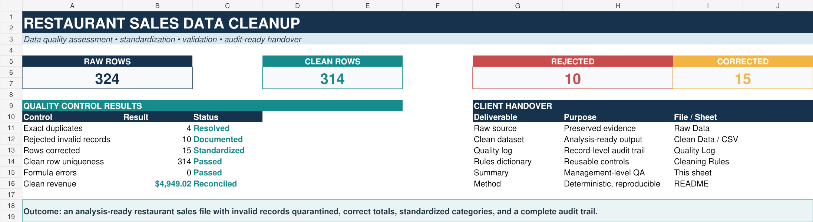

# F01 — Restaurant Daily Sales Data Cleanup

## Client problem

A neighborhood restaurant exports daily point-of-sale transactions for monthly reporting. The source file contains duplicate rows, inconsistent dates and labels, missing payment methods, invalid quantities and discounts, incorrect prices, and line-total errors. Using the file without validation would overstate revenue and fragment product and channel reporting.

## Solution delivered

This project converts the messy POS export into a validated, analysis-ready dataset while preserving record-level evidence of every rejection and correction.

- Standardized dates, item names, categories, payment methods, and order channels
- Validated transaction IDs, times, quantities, discounts, menu prices, and calculated totals
- Removed exact duplicates without deleting source evidence
- Quarantined invalid rows and documented the rejection reason
- Corrected recoverable values using an approved menu master
- Produced a clean CSV, Excel quality-control workbook, rules dictionary, and audit log

## Business result

| Measure | Result |
|---|---:|
| Raw rows received | 324 |
| Clean rows delivered | 314 |
| Rejected rows | 10 |
| Exact duplicates removed | 4 |
| Retained rows corrected | 15 |
| Clean revenue | $4,949.02 |
| Formula errors | 0 |

The final dataset is ready for KPI reporting by date, menu item, category, payment method, and order channel.

## Tools and skills demonstrated

- Excel data cleaning and quality assurance
- Business-rule definition
- Duplicate detection and exception handling
- Category and text standardization
- Revenue reconciliation
- Audit-trail design
- Client-facing documentation

## Repository contents

```text
F01-restaurant-daily-sales-cleanup/
├── README.md
├── assets/
│   └── cleanup-summary-preview.png
├── sample-data/
│   └── restaurant_sales_raw.csv
└── solution/
    ├── Restaurant_Sales_Data_Cleanup.xlsx
    ├── restaurant_sales_clean.csv
    └── validation_metrics.json
```

## Workbook guide

- **Cleanup Summary** — management-level before/after results and handover status
- **Raw Data** — unchanged source records for traceability
- **Clean Data** — standardized and validated transaction table
- **Quality Log** — source row, disposition, validation result, and applied correction
- **Cleaning Rules** — reusable field rules and final control reconciliation

## How to review

1. Open `Restaurant_Sales_Data_Cleanup.xlsx`.
2. Start with **Cleanup Summary**.
3. Filter **Quality Log** by `Rejected` or `Corrected` to inspect exception handling.
4. Use **Cleaning Rules** to verify the acceptance criteria.
5. Use `restaurant_sales_clean.csv` as the downstream reporting source.

## Portfolio note

The dataset is synthetic but deliberately designed to reproduce common restaurant POS data-quality failures. The cleaning decisions, validation rules, audit structure, and deliverables reflect a realistic freelance client engagement.


