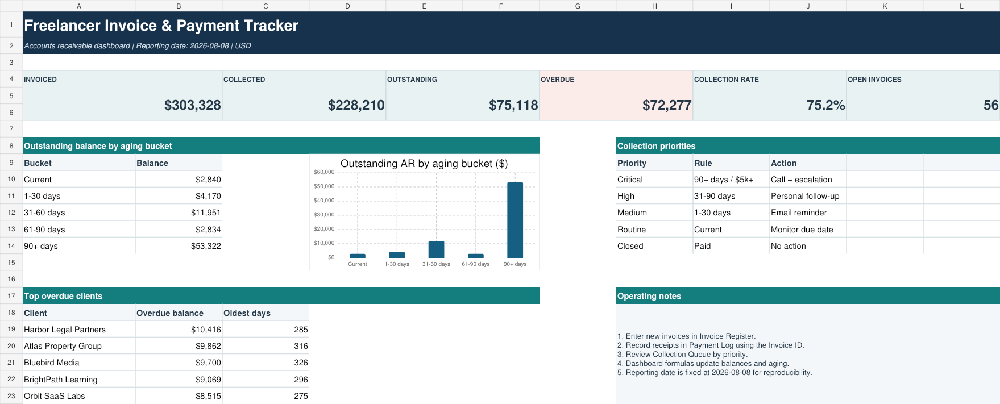

# Freelancer Invoice and Payment Tracker

An Excel accounts-receivable system for freelancers and small service businesses that need to connect invoices, partial payments, outstanding balances, overdue aging, and follow-up actions in one auditable workflow.



## Client problem

Invoice and payment records were maintained separately, making it difficult to answer three basic questions: how much cash has been collected, which invoices remain unpaid, and who needs to be contacted first. Partial payments also created unreliable manual balances.

## Solution delivered

The workbook links every payment to an invoice ID, calculates paid and outstanding amounts, ages only the remaining balance, and creates a prioritized collection queue. A management dashboard summarizes billing, cash collection, open receivables, overdue exposure, aging, and the clients with the largest overdue balances.

## Validated results

| KPI | Result |
|---|---:|
| Invoices processed | 180 |
| Invoice value | $303,327.70 |
| Cash collected | $228,210.05 |
| Collection rate | 75.2% |
| Outstanding receivables | $75,117.65 |
| Overdue receivables | $72,277.35 |
| Open invoices | 56 |
| Overdue invoices | 53 |
| Payment records allocated | 169 |
| Validation controls passed | 10 / 10 |

## Workbook features

- Formula-driven invoice-to-payment allocation
- Correct handling of partial and split payments
- Current, 1–30, 31–60, 61–90, and 90+ day aging
- Critical, high, medium, and routine collection priorities
- Client-level invoiced, collected, outstanding, and overdue summaries
- Visible allocation checks for every payment receipt
- Fixed reporting date for reproducible portfolio results
- Ten reconciliation and data-quality controls

## Files

```text
F02-freelancer-invoice-payment-tracker/
├── README.md
├── LICENSE
├── assets/
│   └── dashboard-preview.png
├── documentation/
│   └── USER_AND_QA_GUIDE.md
├── sample-data/
│   ├── clients.csv
│   ├── invoices.csv
│   └── payments.csv
└── solution/
    ├── Freelancer_Invoice_and_Payment_Tracker.xlsx
    └── validated_kpis.json
```

## How to use

1. Add or replace invoice rows in **Invoice Register**.
2. Record each receipt in **Payment Log** using the correct Invoice ID.
3. Confirm the payment allocation check says `MATCHED`.
4. Review **Collection Queue** from Critical to Routine.
5. Confirm **Checks** reports `PASS` before sharing the dashboard.

## Tools and skills demonstrated

Microsoft Excel, accounts-receivable analysis, invoice tracking, payment allocation, financial reconciliation, aging analysis, KPI reporting, conditional formatting, dashboard design, data quality, and client handover documentation.

## Data note

All companies, contacts, emails, invoices, and payments are synthetic and created solely for portfolio demonstration.

