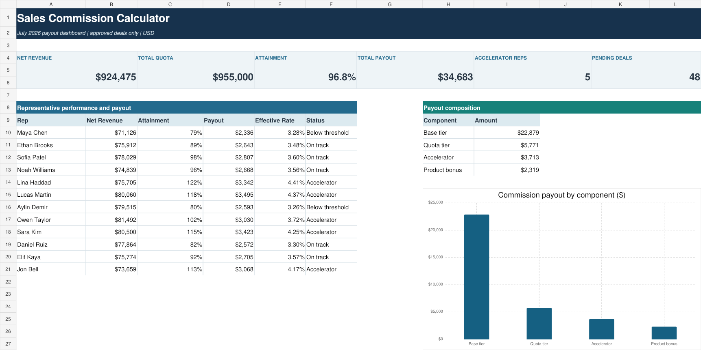

# Sales Commission Calculator

A client-ready Excel commission model for a 12-person B2B sales team. It converts approved deal-level revenue into auditable monthly payouts using split credit, returns, marginal quota tiers, accelerators, and product bonuses.

## Business problem

Manual commission files often apply a single rate to total sales, overlook returns, mishandle shared deals, and provide little evidence for Finance or representatives. This project creates a governed source-to-statement workflow in which every payout can be traced to an approved transaction and a visible policy assumption.

## July 2026 result

- 240 source transactions
- 192 approved transactions included in payout
- 48 pending transactions excluded
- $934,939.00 approved gross credited revenue
- $10,463.88 credited returns
- $924,475.12 net commissionable revenue
- $955,000.00 team quota
- 96.8% team attainment
- $34,682.81 total commission payout
- 5 representatives earning accelerator commission
- 10 of 10 validation controls passed

## Commission logic

1. Multiply gross revenue and returns by the transaction credit percentage.
2. Include only transactions with `Approved` status.
3. Deduct credited returns before measuring quota attainment.
4. Apply marginal rates: 3% through 80% of quota, 5% from 80% to 100%, and 8% above quota.
5. Add a 1% bonus on eligible net credited product revenue.
6. Produce one summarized payout statement per representative.

## Repository contents

- `solution/Sales_Commission_Calculator.xlsx` — working Excel model
- `sample-data/` — import-ready transaction, rep, and rule datasets
- `documentation/USER_AND_QA_GUIDE.md` — operating instructions and controls
- `solution/validated_kpis.json` — independent expected-result baseline
- `assets/dashboard-preview.png` — portfolio preview

## Skills demonstrated

Excel financial modeling, commission-plan interpretation, tiered calculations, SUMPRODUCT, approval workflow, revenue crediting, returns and clawbacks, reconciliation controls, dashboard design, and stakeholder-ready documentation.

## Data note

All organizations, people, accounts, transactions, and values are synthetic and created solely for portfolio demonstration.

## License

MIT License. See `LICENSE`.
