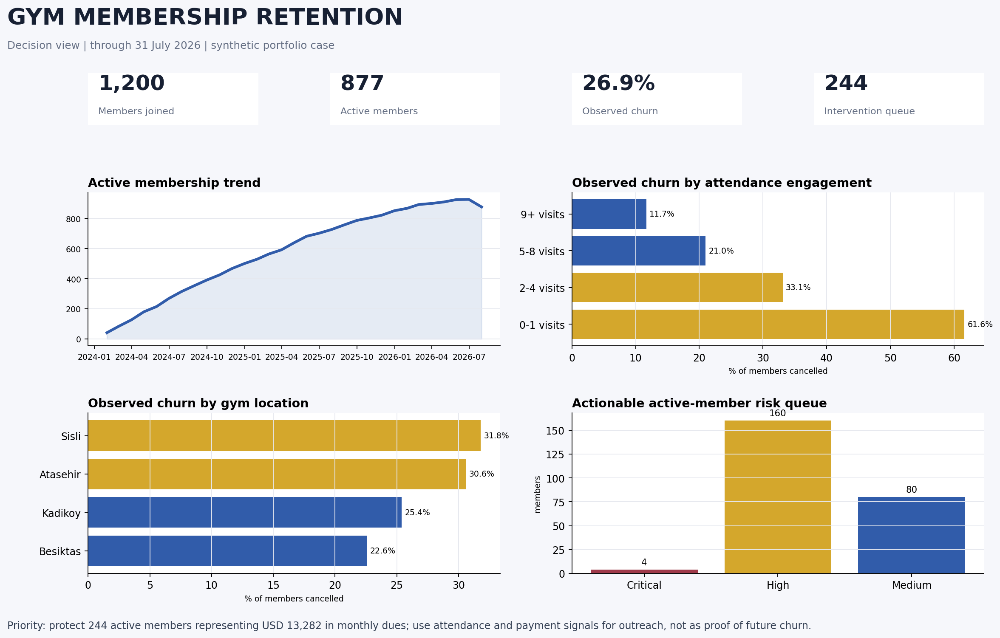

# Gym Membership Retention Analysis

An end-to-end SQL retention case for a multi-location fitness operator. The project converts member, attendance, payment, plan, and location records into governed retention metrics and an active-member intervention queue.



## Business question

Where is member attrition concentrated, which behaviors are associated with it, and which active members should operations contact now?

## Headline results

- **1,200** members observed; **877** active at the reporting cutoff
- **323** cancellations; **26.9%** observed churn across the full joined population
- **244** active members prioritized for payment recovery or re-engagement
- **USD 13,282.00** in monthly dues represented by the intervention queue
- **101,575** check-ins and **18,451** payment events analyzed
- All **12** independent controls passed

## What is included

- Runnable SQLite database and six source CSVs
- 12 annotated SQL analyses
- Monthly active-member trend and cohort-ready snapshot table
- Plan, location, acquisition, attendance, payment, and churn-timing diagnostics
- Prioritized member intervention queue
- Metric governance, data dictionary, analytical report, runbook, validation evidence, and preview

## Run

```bash
sqlite3 data/gym_retention.db < queries/01_retention_analysis.sql
```

Synthetic data is used so the project can be shared publicly. Observed associations are not presented as causal effects or model predictions.
