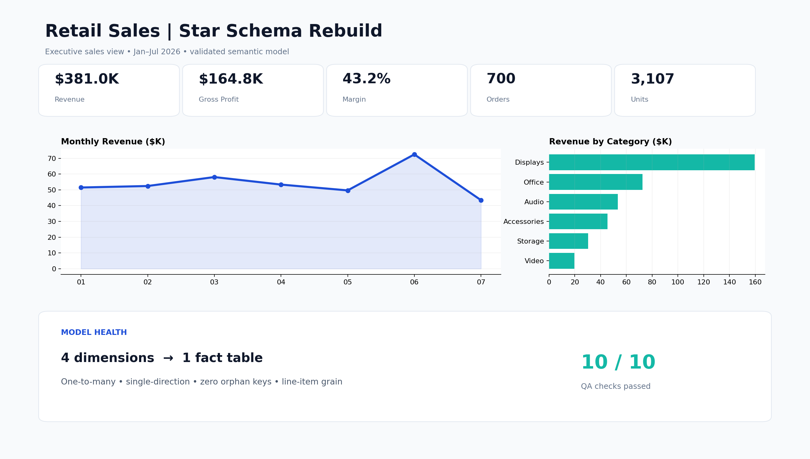

# F14 — Power BI Star Schema Rebuild

## Client problem
A retail sales report was built directly from a denormalized export. Repeated customer, product, store, and date fields created inconsistent filtering, fragile measures, and an unclear analytical grain.

## Solution delivered
The dataset was remodeled into a documented star schema with four conformed dimensions and one transaction-line fact table. The package includes import-ready data, relationship rules, Power Query typing, DAX measures, a report theme, dashboard blueprint, and a verified reconciliation baseline.

## Business result
- 1,037 sales lines and 700 orders modeled
- $381,041.80 revenue and $164,757.80 gross profit reconciled exactly
- 12 products, 180 customers, 4 stores, and 203 calendar dates governed through dimensions
- 10 of 10 model-quality controls passed

## Model
`DimDate`, `DimCustomer`, `DimProduct`, and `DimStore` filter `FactSales` through one-to-many, single-direction relationships. `FactSales` remains at one-row-per-order-line grain.

## Tools demonstrated
Power BI data modeling, Power Query, DAX, dimensional modeling, relationship design, model QA, reconciliation, and dashboard specification.

## Rebuild
Follow `documentation/BUILD_AND_QA_GUIDE.md`. A native `.pbix` is not included because it must be authored in Power BI Desktop; every source and specification needed for a genuine rebuild is included.
