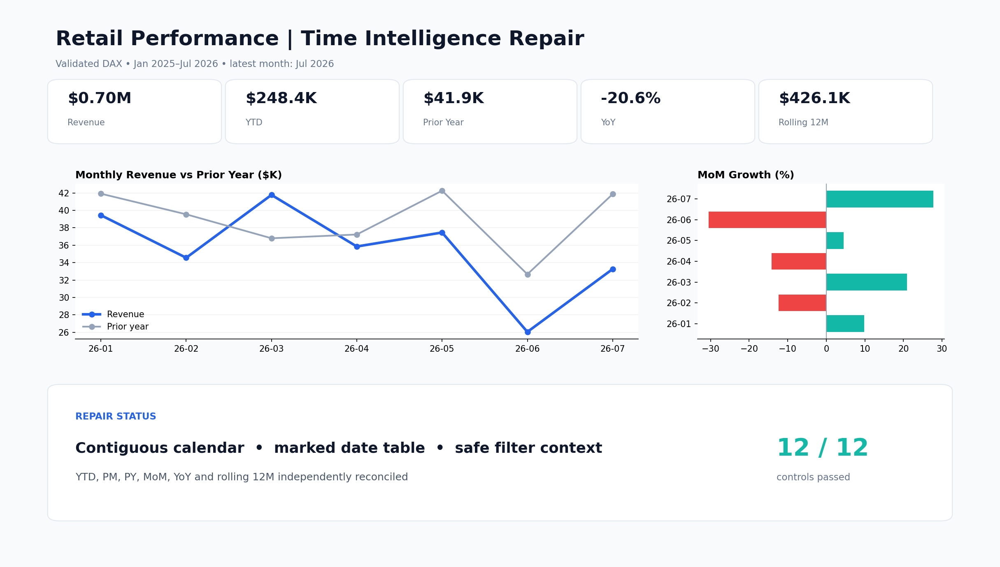

# F15 — DAX Time Intelligence Repair

## Client problem
A retail Power BI report produced inconsistent YTD, prior-year, month-over-month, and rolling-12-month results. The numbers changed across visuals because time functions referenced transaction dates and the date model was incomplete.

## Solution delivered
The date model and measures were repaired together: a contiguous marked calendar, a single-direction relationship, filter-safe DAX, explicit period anchors, and an independently calculated monthly baseline for verification.

## Business result
- 1,749 sales records across 577 calendar days
- $698,439.80 revenue reconciled
- $248,403.00 latest YTD revenue validated
- $426,149.85 rolling-12-month revenue validated
- 12 of 12 controls passed

## Skills demonstrated
DAX debugging, time intelligence, date-table design, filter context, Power Query typing, model relationships, independent reconciliation, and Power BI dashboard specification.

## Rebuild
Follow `documentation/BUILD_AND_QA_GUIDE.md`. Native `.pbix` files require Power BI Desktop; this package includes every source, measure, rule, baseline, and design asset needed for a genuine build.
