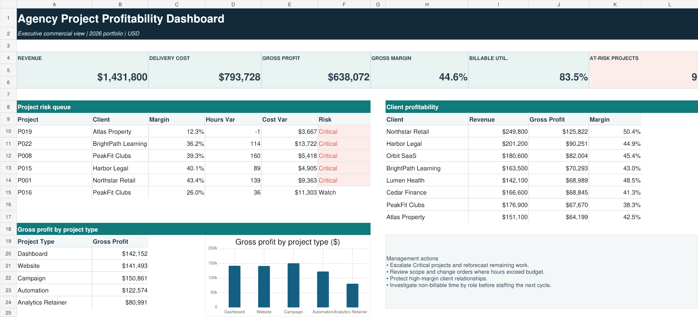

# F16 — Agency Project Profitability Dashboard

## Client problem

A digital agency had contract revenue, staff time, labor rates, and vendor costs in separate exports. Leadership could see sales but could not reliably identify profitable clients, delivery overruns, or projects requiring intervention.

## Solution delivered

This project combines four import-ready datasets into an auditable profitability model. It calculates actual delivery cost, gross profit, margin, budget variance, billable utilization, client profitability, and a rules-based project risk queue.

## Business results

- 24 projects and 395 time entries analyzed
- $1,431,800 contract revenue
- $793,728 actual delivery cost
- $638,072 gross profit
- 44.6% portfolio gross margin
- 83.5% billable utilization
- 5 Critical and 4 Watch projects identified
- 10 of 10 validation controls passed

## Tools and skills

Excel, Power Query, Power BI data modeling, DAX, profitability analysis, budget variance, utilization analysis, data validation, and executive dashboard design.

## Repository contents

- sample-data — clients, projects, time entries, and vendor costs
- solution/Agency_Project_Profitability_Dashboard.xlsx — working analytical dashboard
- solution/measures.dax — reusable Power BI measures
- solution/FactProjectProfitability.pq — Power Query transformation
- documentation — data model, dashboard specification, and build/QA guide
- assets/dashboard-preview.png — portfolio preview

## Analytical rules

- Actual cost = labor cost + allocated vendor cost
- Gross profit = contract revenue − actual cost
- Gross margin = gross profit ÷ contract revenue
- Critical = margin below 20% or actual hours above 115% of budget
- Watch = margin below 30% or actual hours above 105% of budget
- Utilization = billable hours ÷ total recorded hours

The repository is a reproducible build kit. Create a genuine PBIX in Power BI Desktop by importing the four CSV files and following the included documentation.

