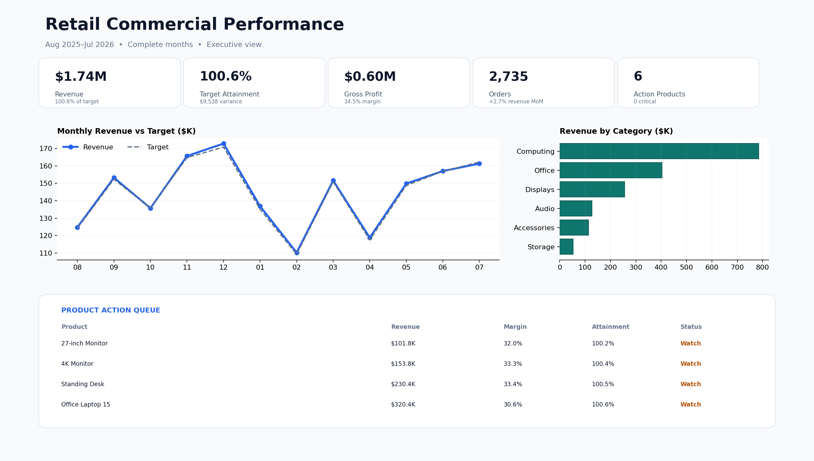

# F17 — Power BI Dashboard Redesign

## Client problem
A regional retail dashboard contained correct totals but was difficult to use: crowded KPIs, inconsistent period context, a dual-axis trend, rainbow colors, weak labels, and no clear route from underperformance to action.

## Solution delivered
The same governed dataset was redesigned into a focused executive report. The new hierarchy moves from portfolio status to trend, commercial drivers, and a ranked product action queue. The package preserves before/after evidence and documents every high-impact design decision.

## Validated business baseline
- 2,735 orders and 4,388 units
- $1,737,992.95 revenue against $1,728,455.08 target
- 100.6% target attainment
- $600,041.95 gross profit and 34.5% gross margin
- 6 products requiring follow-up
- 10 design issues repaired and 10 of 10 data controls passed

## Skills demonstrated
Power BI UX redesign, executive information hierarchy, chart selection, DAX, Power Query, dimensional modeling, accessibility, exception reporting, and KPI reconciliation.

## Rebuild
Follow `documentation/BUILD_AND_QA_GUIDE.md`. The repository includes the source data, transformation, measures, theme, audited design decisions, validated KPI baseline, and dashboard specification required to create a genuine `.pbix` in Power BI Desktop.
