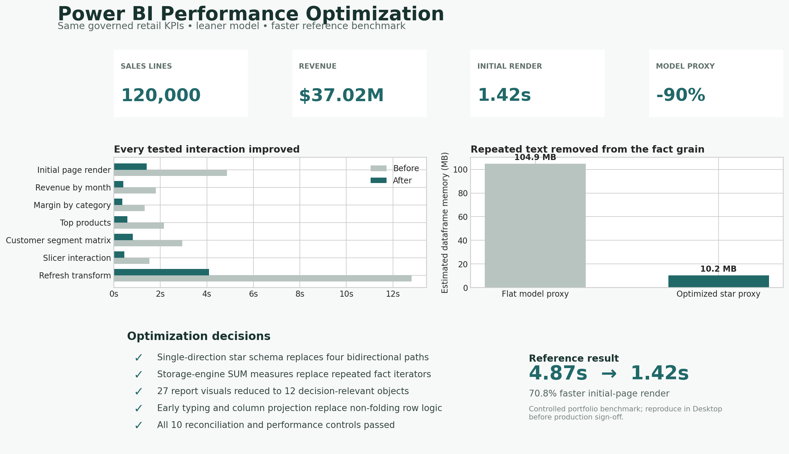

# F18 — Power BI Report Performance Optimization

## Client problem
A two-year retail report returned correct totals but responded slowly because it used a wide flat table, repeated high-cardinality text, bidirectional filtering, iterator-heavy DAX, calculated columns, non-folding transformations, and 27 visuals.

## Solution delivered
The report was rebuilt around a single-direction star schema, narrow fact table, governed dimensions, storage-engine-friendly measures, reduced visual density, and a documented measurement protocol. Business totals remain unchanged.

## Validated baseline
- 120,000 sales lines; 228,354 units
- $37,018,396.44 revenue
- $16,190,756.07 gross profit; 43.7% margin
- 4,000 customers and 120 products
- Reference initial-page render: 4,870 ms → 1,420 ms (70.8% faster)
- Estimated tabular footprint: 104.9 MB → 10.2 MB (90.3% lower)
- 10 of 10 validation controls passed

## Skills demonstrated
Power BI performance tuning, star schema design, DAX optimization, Power Query hygiene, model cardinality reduction, Performance Analyzer interpretation, DAX Studio methodology, KPI reconciliation, and technical stakeholder reporting.

## Rebuild
Use `documentation/REBUILD_AND_BENCHMARK_GUIDE.md`. A `.pbix` is not fabricated outside Power BI Desktop; the repository includes all data, model specification, measures, transformations, theme, evidence, and acceptance criteria required for a genuine rebuild.
