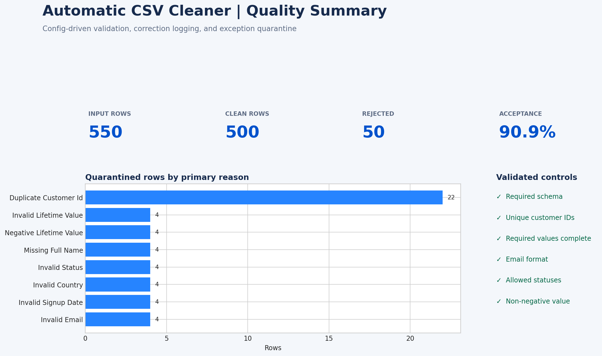

# F22 — Automatic CSV Cleaner

## Client problem

A growing e-commerce business receives recurring customer CSV exports with inconsistent headers, mixed date formats, formatting noise, duplicate account IDs, malformed emails, invalid categories, and unsafe numeric values. Manual cleanup is slow, inconsistent, and difficult to audit.

## Solution delivered

This project provides a reusable Python command-line cleaner that validates the source schema, applies approved standardizations, quarantines unsafe records, and produces inspectable quality evidence.

- Config-driven aliases, category mappings, date formats, and acceptance rules
- Deterministic text, email, date, country, status, and currency normalization
- Duplicate-key, completeness, format, domain, and range validation
- Separate clean and rejected datasets
- Field-level before/after audit log
- Machine-readable quality metrics and automated tests
- Fast failure when required source columns are missing

## Business result

| Measure | Result |
|---|---:|
| Input rows assessed | 550 |
| Clean records delivered | 500 |
| Rejected records quarantined | 50 |
| Acceptance rate | 90.9% |
| Duplicate IDs rejected | 22 |
| Field corrections logged | 2,504 |
| Duplicate IDs in clean output | 0 |
| Missing required values in clean output | 0 |
| Automated tests passed | 2 of 2 |

## Tools and skills demonstrated

- Python and pandas automation
- Command-line interface design
- Config-driven business rules
- Data profiling and validation
- Duplicate and exception management
- Audit-trail and reproducibility design
- Unit testing and client documentation

## Repository contents

```text
F22-automatic-csv-cleaner/
├── README.md
├── requirements.txt
├── config/cleaning_rules.json
├── sample-data/customers_messy.csv
├── src/csv_cleaner.py
├── tests/test_csv_cleaner.py
├── scripts/
│   ├── generate_sample_data.py
│   └── create_preview.py
├── solution/
│   ├── customers_clean.csv
│   ├── customers_rejected.csv
│   ├── cleaning_audit_log.csv
│   └── quality_metrics.json
├── docs/
│   ├── USER_GUIDE.md
│   └── VALIDATION_REPORT.md
└── assets/quality-summary-preview.png
```

## Quick start

```bash
pip install -r requirements.txt
python src/csv_cleaner.py sample-data/customers_messy.csv \
  --config config/cleaning_rules.json \
  --output-dir solution
python -m unittest discover -s tests -v
```

## Cleaning policy

The tool automatically applies only safe, explainable corrections. It does not invent missing names, repair ambiguous emails, or reinterpret invalid monetary values. Unsafe records are quarantined with explicit reasons so the client can correct them at source.

## Portfolio note

The dataset is synthetic and reproducible. The architecture, business rules, exception logic, audit trail, test suite, and client handover reflect a realistic freelance data-cleaning engagement.


