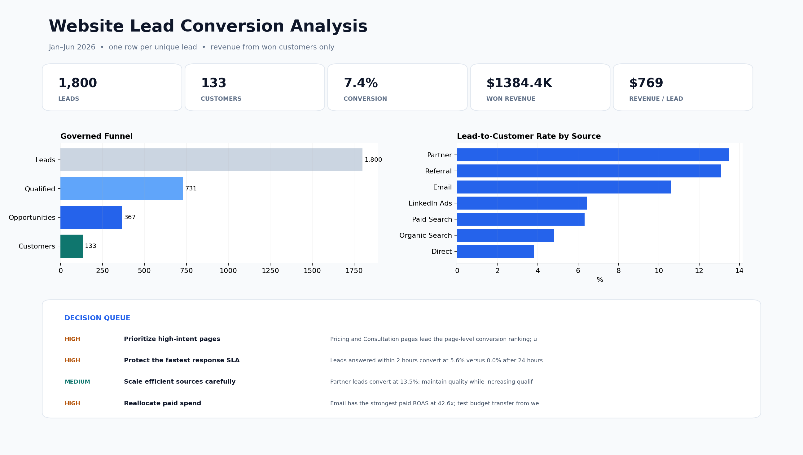

# F24 — Website Lead Conversion Analysis

+## Client problem
+A service business had website-lead exports but could not distinguish high-volume sources from sources that generated qualified opportunities, customers, and revenue.

+## Solution delivered
+A reusable Python analysis validates funnel order, measures conversion at the correct denominator, compares source/page/device/response-time segments, connects paid spend to CAC and ROAS, and produces an operational follow-up queue.

+## Validated results
+- 1,800 unique leads and 133 customers
+- 7.39% lead-to-customer conversion
+- $1,384,385.03 won revenue
+- $769.10 revenue per lead
+- 731 qualified leads and 367 opportunities
+- All 10 validation controls passed; both automated tests passed

+

+## Skills demonstrated
+Python, pandas, funnel analysis, segmentation, marketing efficiency, CAC/ROAS, response-time analysis, data validation, visualization, and operational recommendations.

+## Reproduce
+Run the commands in `docs/ANALYSIS_AND_QA.md`. The tool writes governed CSV outputs and a JSON KPI baseline; source data remains unchanged.
